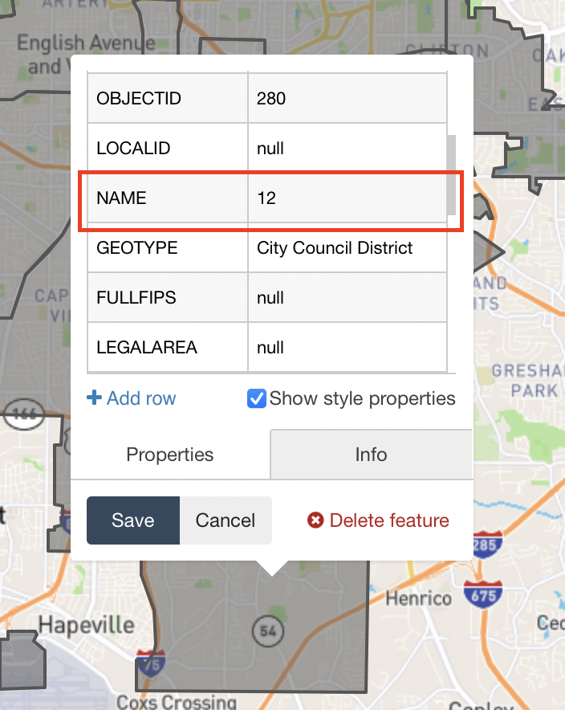

# Pedestrian-and-bike-crashes

A Twitter bot that tweets Bicyclist and Pedestrian related crashes, using Citizen data.


### Run
`npm install` to fetch and install dependencies.

To run: `node index.js --location cityNameOne`, where `cityNameOne` is the name of the city you want to fetch and tweet data for (see `keys` section for more information).

### Keys file
To use, create a `keys.js` with the following format for each city you want to fetch and tweet data for:

```js
module.exports = {
    cityNameOne: {
        consumer_key: 'consumer_key',
        consumer_secret: 'consumer_secret',
        access_token: 'access_token',
        access_token_secret: 'access_token_secret',
        lowerLatitude: 'lowerLatitude',
        lowerLongitude: 'lowerLongitude',
        upperLatitude: 'upperLatitude',
        upperLongitude: 'upperLongitude',
        timeZone: 'America/New_York',
    },
    cityNameTwo: {
        consumer_key: 'consumer_key',
        consumer_secret: 'consumer_secret',
        access_token: 'access_token',
        access_token_secret: 'access_token_secret',
        lowerLatitude: 'lowerLatitude',
        lowerLongitude: 'lowerLongitude',
        upperLatitude: 'upperLatitude',
        upperLongitude: 'upperLongitude',
        timeZone: 'America/Los_Angeles',
    },
    ...
};
```

To get the `consumer_key`, `consumer_secret`, `access_token`, and `access_token_secret` values, you'll need to sign up for a [Twitter Developer account](https://developer.twitter.com/en).

To get the `lowerLatitude`, `lowerLongitude`, `upperLatitude`, and `upperLongitude` values, you'll need to go to the [Citizen explore page](https://citizen.com/explore). Open up the developer tools in your browser, go to the network tab, and select the city you want to see incidents for. Select the `trending` API call and the latitude and longitude values are the parameters in the URL.

The `timeZone` value is used for converting incident times (Citizen stores them in UTC) to the city's local time. The `timeZone` value for your city can be found [here](https://en.wikipedia.org/wiki/List_of_tz_database_time_zones) - use the value in the `TZ database name` column. If your city isn't listed just use the closest major city (ex. for Philadelphia use America/New_York).

---

### Advanced
#### Satellite image of crash site
The bot can tweet zoomed in satellite images of the crash site, in addition to the standard citizen map. The Google map is a zoomed-in satellite image of the location of the crash and the Citizen map shows a simplified larger context. To enable inclusion of maps in your incident tweets, you'll first need to add a `googleKey` property to your city object in the `keys.js` file containing an API key from a [Google Developer Platform account](https://developers.google.com/maps/documentation/maps-static/get-api-key). You will need to enable the Maps Static API for your key. Then place your API key in the keys file:

```js
module.exports = {
    cityNameOne: {
        consumer_key: 'consumer_key',
        consumer_secret: 'consumer_secret',
        ...
        googleKey: 'google_api_key',
    },
    ...
};
```

Then, call the bot with the `--tweetSatellite` flag and each incident thread will contain both a satellite image of the crash site and the standard citizen map: 

```node index.js --location atlanta --tweetSatellite```

#### Representatives
The bot has the ability to determine the exact city council district a crash occurred in, and tweet the name of the district and representative in addition to the crash information.


To set this up, you'll need to:

1. Create a geojson file of your city council districts
2. Host the geofile on the internet
3. Create an object in the `representatives.js` file for your city (atlanta is included as an example)
4. Run the bot: `node index.js --location cityNameOne --tweetReps`

##### Create a geojson file of your city council districts
A geojson file is a file containing geographic shapes. The bot uses this file to map a crash to the city council district it happened in. 

You can create a geojson file of your city council districts by going to [geojson.io](http://geojson.io) and tracing out the districts. You'll also need to add a `NAME` property to each district you draw.




##### Host the geofile on the internet
Once you've created the geofile, you'll need to host it somewhere so the bot can download it. Examples of places you could host it are Google Drive or in an AWS S3 bucket. You'll need the URL to the file.

##### Create an object in the `representatives.js` file
Next, you'll need to add an object to the `representatives.js` file that maps the name of each city council district to its representative's name (or Twitter account if you want to tag them). You'll also need to add the geojson url and representative district term. The representative district term is just what a city council district is called in your city (for example, maybe you live in Chicago which would refer to city council districts as wards).

###### At Large city councilmembers
If your city has at large councilmembers, you can include an `atLarge` property with an array containing their names (or Twitter usernames). The bot will tweet their names along with the number of crashes that occurred over the last 24 hours.

